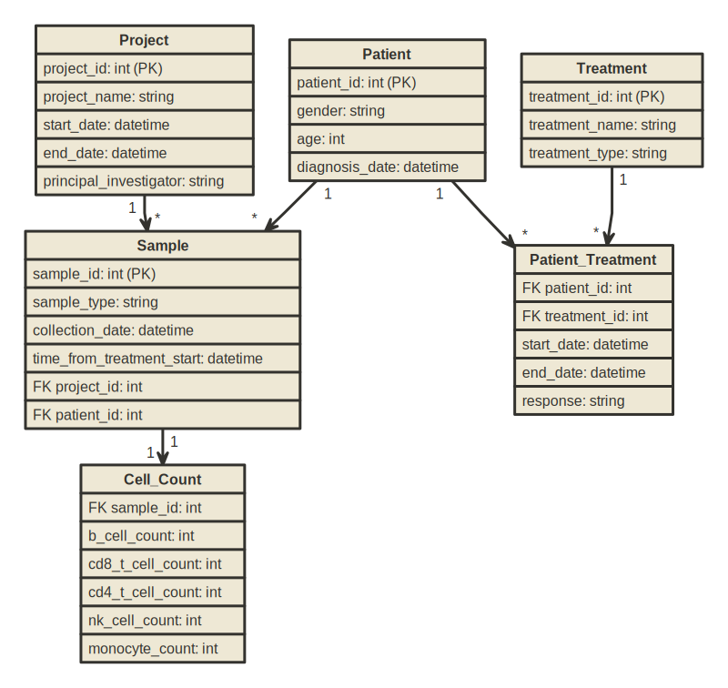

# Database Design for Immune Cell Count Data

## SQL vs No-SQL

Given the task at hand, which involves managing and analyzing data related to immune cell counts, patient demographics, treatment details, and responses across hundreds of projects and thousands of samples, a **SQL database** is the best choice. Here’s why:

### 1. **Structured and Relational Data**
The data we have (cell counts to patient responses) is inherently structured and relational. We have clear relationships:
- Between patients and their treatments.
- Between samples and the projects they belong to.
- Between various treatments and the response outcomes.

These relationships are best managed by a relational database management system (RDBMS) where we can effectively use SQL to create joins, enforce integrity constraints, and maintain data accuracy through transactions.

### 2. **Complex Queries for Analysis**
The analysis requires complex queries that might involve multiple joins and aggregations (e.g., calculating average cell counts, comparing responder vs. non-responder data). SQL databases excel at handling such queries, providing powerful tools to perform extensive data manipulation and retrieval operations that are crucial for detailed statistical analysis and reporting.

### 3. **ACID Compliance**
Accuracy and consistency are paramount in clinical and research databases. SQL databases are ACID-compliant, ensuring that all transactions are processed reliably and that the database remains accurate and consistent even in cases of a system failure or power failures. This is critical for maintaining the integrity of clinical data.

### 4. **Scalability with Structured Expansion**
Although NoSQL databases offer great scalability, SQL databases can also scale sufficiently for the sizes typically involved in clinical and research databases. Modern SQL databases can handle large loads and complex operations efficiently, especially with proper indexing, query optimization, and in some cases, horizontal scaling techniques such as sharding or partitioning. In case there is a requirement for horizontal scaling cloud-native solutions can be leveraged : 
- Google Cloud Spanner is a fully managed relational database service that offers ACID transactions, SQL semantics, and automatic, synchronous replication for high availability. It's designed to combine the benefits of relational database structure with non-relational horizontal scale.
- Part of AWS, Aurora is a MySQL and PostgreSQL-compatible relational database built for the cloud, which scales horizontally. It automatically distributes data across multiple Availability Zones and continuously backs up data to Amazon S3.
- Azure SQL Database is a fully managed database service that offers dynamic scalability with a SQL Server engine compatibility. It supports a wide range of applications from small to large scale.

### 5. **Mature Tools and Broad Support**
SQL databases benefit from a wide range of mature management tools and extensive community support. This includes advanced security features, backup solutions, and integration options with other data analysis tools and platforms, which are essential for managing sensitive and complex datasets in a research or clinical environment.

### Conclusion
A SQL database not only fits the need for structured data handling and complex query execution but also supports the integrity, accuracy, and detailed reporting required in a research setting where immune cell analysis and treatment efficacy are studied. This makes it an ideal choice for this project, providing the robustness and functionality needed to support the complex relationships and data integrity requirements of this dataset.

## Design Considerations

Here are the key entities and their attributes that we might consider:

1. **Projects**: Store details about each research project.
   - `project_id` (Primary Key)
   - `project_name`
   - `start_date`
   - `end_date`
   - `principal_investigator`

2. **Samples**: Capture details about each biological sample.
   - `sample_id` (Primary Key)
   - `project_id` (Foreign Key)
   - `patient_id` (Foreign Key)
   - `sample_type` (e.g., PBMC)
   - `collection_date`
   - `time_from_treatment_start`

3. **Patients**: Information about each subject or patient.
   - `patient_id` (Primary Key)
   - `gender`
   - `age`
   - `diagnosis_date`

4. **Treatments**: Information regarding treatments administered to patients.
   - `treatment_id` (Primary Key)
   - `treatment_name`
   - `treatment_type` (e.g., tr1)

5. **Patient_Treatments**: A junction table to manage the many-to-many relationship between patients and treatments.
   - `patient_id` (Foreign Key)
   - `treatment_id` (Foreign Key)
   - `start_date`
   - `end_date`
   - `response` (e.g., responder, non-responder)

6. **Cell_Counts**: Store the cell count data.
   - `sample_id` (Foreign Key)
   - `b_cell_count`
   - `cd8_t_cell_count`
   - `cd4_t_cell_count`
   - `nk_cell_count`
   - `monocyte_count`

#### Rough Prototype Schema
```
Projects(project_id, project_name, start_date, end_date, principal_investigator)
Patients(patient_id, gender, age, diagnosis_date)
Samples(sample_id, project_id, patient_id, sample_type, collection_date, time_from_treatment_start)
Treatments(treatment_id, treatment_name, treatment_type)
Patient_Treatments(patient_id, treatment_id, start_date, end_date, response)
Cell_Counts(sample_id, b_cell_count, cd8_t_cell_count, cd4_t_cell_count, nk_cell_count, monocyte_count)
```




Based on the Entity Relationship Diagram, here are the relationships along with their cardinalities:

1. **Projects to Samples**:
   - **Cardinality:** One-to-Many (1 -> *)
   - **Description:** Each project can have multiple samples, but each sample is associated with only one project.

2. **Patients to Samples**:
   - **Cardinality:** One-to-Many (1 -> *)
   - **Description:** Each patient can have multiple samples, indicating that samples are collected from the same patient at different times or under different conditions.

3. **Patients to Patient_Treatments**:
   - **Cardinality:** One-to-Many (1 -> *)
   - **Description:** Each patient can have multiple treatment records, reflecting different treatments or treatment episodes a patient undergoes.

4. **Treatments to Patient_Treatments**:
   - **Cardinality:** One-to-Many (1 -> *)
   - **Description:** Each treatment can be associated with multiple patient treatment records, indicating that the same treatment can be administered to different patients or the same patient multiple times.

5. **Samples to Cell_Counts**:
   - **Cardinality:** One-to-One (1 -> 1)
   - **Description:** Each sample has exactly one set of cell counts, implying a direct and exclusive relationship between a sample and its cell count data.

These relationships outline the database structure's flow and constraints, ensuring data integrity and proper relational mapping within the database system.

### Task 2: Advantages of Using a Database
- **Scalability**: Easily handle large volumes of data across hundreds of projects and thousands of samples.
- **Data Integrity**: Enforce data consistency and accuracy through relational integrity and transaction controls.
- **Query Capability**: Facilitate complex queries for deep analytics, such as responder vs. non-responder comparisons.
- **Centralized Management**: Manage all data from a central location, enhancing data security and access controls.
- **Reporting and Analysis**: Simplify reporting and analysis through structured query language (SQL), supporting real-time and batch processing insights.

### Task 3: SQL Queries Based on the Schema
Here are the SQL queries for each of the tasks outlined, along with explanations for each one:

### Query1: Summarize the Number of Subjects Available for Each Condition

```sql
SELECT treatment_id, response, COUNT(DISTINCT patient_id) AS number_of_subjects
FROM Patient_Treatments
GROUP BY treatment_id, response;
```

**Explanation**:
- This query retrieves the number of unique subjects (patients) for each treatment and response category.
- `COUNT(DISTINCT patient_id)` counts the number of unique patient IDs to ensure that each patient is only counted once per condition.
- `GROUP BY treatment_id, response` organizes the results by each treatment and the associated response, allowing you to see how many subjects are in each specific category of response for each treatment.

### Query2: Return All Melanoma PBMC Samples at Baseline from Patients Who Have Treatment tr1

```sql
SELECT s.*
FROM Samples s
JOIN Patient_Treatments pt ON s.patient_id = pt.patient_id
JOIN Treatments t ON pt.treatment_id = t.treatment_id
WHERE s.sample_type = 'PBMC'
AND s.time_from_treatment_start = 0
AND t.treatment_name = 'tr1';
```

**Explanation**:
- This query selects all columns from the `Samples` table.
- It joins `Samples` with `Patient_Treatments` on `patient_id` and `Patient_Treatments` with `Treatments` on `treatment_id` to link the sample data with treatment data.
- The `WHERE` clause filters samples to only include those that are PBMCs, taken at the baseline (`time_from_treatment_start = 0`), and associated with the treatment named 'tr1'.

### Query3: How Many Samples from Each Project

```sql
SELECT project_id, COUNT(sample_id) AS sample_count
FROM Samples
WHERE sample_id IN (
    // Query 2 As Sub Query //
)
GROUP BY project_id;
```

**Explanation**:
- This query first identifies the relevant sample IDs from Query2.
- It then counts how many samples come from each project.
- `GROUP BY project_id` organizes the count by each project, showing how many eligible samples each project contributed.

### Query4: How Many Responders/Non-responders

```sql
SELECT response, COUNT(DISTINCT s.sample_id) AS sample_count
FROM Samples s
JOIN Patient_Treatments pt ON s.patient_id = pt.patient_id
WHERE s.sample_id IN (
    // Query 2 As Sub Query //
)
GROUP BY response;
```

**Explanation**:
- Similar to the previous breakdowns, this query first determines which samples meet the criteria set in Query2.
- It then groups these samples by the `response` field from the `Patient_Treatments` table to show how many samples belong to responders versus non-responders.

#### Query5: How Many Males, Females

```sql
SELECT gender, COUNT(DISTINCT s.sample_id) AS sample_count
FROM Samples s
JOIN Patients p ON s.patient_id = p.patient_id
WHERE s.sample_id IN (
    // Query 2 As Sub Query //
)
GROUP BY gender;
```

**Explanation**:
- This query links `Samples` to `Patients` to access demographic data.
- It filters samples based on the criteria from Query 4, then groups the results by gender, counting how many samples there are from male and female patients.

Each of these queries is designed to extract specific data from a complex relational database, allowing for detailed analysis and reporting on treatment responses and demographics within the context of specific sample types and conditions.
