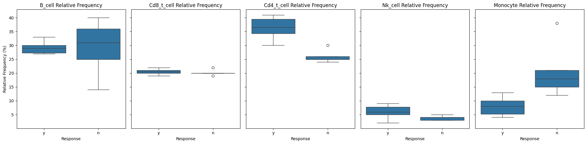

## Visual Analysis of Immune Cell Relative Frequencies in Response to Treatment tr1

#### Background
Analyzing the provided box plots of immune cell relative frequencies between responders ('y') and non-responders ('n') to treatment tr1 has yielded several insights about the distribution and potential significance of each cell population in relation to the treatment's effectiveness. This analysis focused on B-cells, CD8 T-cells, CD4 T-cells, NK cells, and monocytes.



#### Key Findings

1. **B-cells**:
   - **Narrower Interquartile Range (IQR) in Responders**: Indicates a more consistent immune profile, suggesting a uniform mechanism of action of the treatment.
   - **Wider IQR in Non-Responders**: Suggests greater heterogeneity in immune responses, influenced by factors such as genetic diversity and disease variability.
   - **Potential Biomarker with Limitations**: B-cell frequency alone may not definitively predict treatment response due to overlaps in frequencies between groups.

2. **CD8 T-cells**:
   - No significant differences in median relative frequencies, suggesting that CD8 T-cell levels alone may not predict treatment response.
   - The presence of outliers in non-responders suggests potential subgroups with atypical responses.

3. **CD4 T-cells**:
   - Higher median relative frequencies in responders, indicating a potential role in effective treatment response.
   - Suggests potential as a predictive biomarker for treatment efficacy.

4. **NK cells**:
   - Higher frequencies in responders, suggesting their active role in a successful immune response.
   - Variability among responders could indicate different levels of immune activation.

5. **Monocytes**:
   - Lower frequencies in responders, suggesting their lower presence might be beneficial for treatment response.
   - Greater consistency among responders compared to non-responders, suggesting potential predictive value in lower frequencies.

#### Recommendations for Clinical Application and Research
- **Tailored Therapeutic Strategies**: Insights from this analysis could guide more personalized approaches, adjusting therapies based on individual immune profiles to enhance treatment efficacy.
- **Development of a Composite Biomarker Panel**: Combining immune cell frequencies with other clinical factors could improve predictive models for treatment response.
- **Further Investigation**: Additional research should explore the mechanistic roles of these cells in treatment responses and investigate the outliers in non-responders for potential atypical response patterns.

This comprehensive analysis underscores the complexity of immune responses in melanoma treatment and highlights the potential of leveraging detailed immune profiling to guide treatment strategies. By focusing on the immune cell types that show significant differences between responders and non-responders, clinicians and researchers can better predict treatment outcomes and customize therapies to achieve the best possible results.

## Statistical Analysis of Immune Cell Frequencies in Response to Treatment tr1

### Results from Independent samples-t test

```
B_cell - Statistics=-0.008, p-value=0.994

Cd8_t_cell - Statistics=0.463, p-value=0.654

Cd4_t_cell - Statistics=4.941, p-value=0.001

Nk_cell - Statistics=1.848, p-value=0.098

Monocyte - Statistics=-2.904, p-value=0.017
```


The comprehensive analysis of immune cell relative frequencies in melanoma patients undergoing treatment tr1 has provided valuable insights into the immunological dynamics associated with treatment responses. The statistical tests conducted, particularly the independent samples t-tests on the normally distributed data, have validated observations from initial box plot visualizations, allowing for a robust conclusion regarding the immune profiles of responders and non-responders.

#### Key Findings:
- **CD4 T-cells**: There is a statistically significant difference in the relative frequencies of CD4 T-cells between responders and non-responders, with responders exhibiting higher levels. This finding supports the hypothesis that CD4 T-cells play a crucial role in mediating a positive response to treatment tr1, likely through their functions in orchestrating other immune responses and enhancing immune system communication.
- **Monocytes**: Similarly, monocytes showed significant differences in relative frequencies, with lower levels generally observed in responders compared to non-responders. This suggests that lower monocyte levels might be favorable in the context of this specific treatment, potentially related to reduced inflammatory responses or a more efficient immunological reaction against tumor cells.

#### Implications:
These findings underscore the potential of leveraging specific immune cell frequencies as biomarkers for predicting treatment outcomes. The significant roles of CD4 T-cells and monocytes, in particular, suggest pathways through which the treatment may be exerting its effects, and which could be targeted for therapeutic advantage.

#### Recommendations:
1. **Clinical Application**: Incorporating the measurement of CD4 T-cell and monocyte levels into routine diagnostic assessments may help predict patient responses to treatment tr1, enabling more personalized therapy plans.
2. **Further Research**: Additional studies should focus on exploring the mechanisms by which these cells influence treatment efficacy. This could involve molecular studies to understand the signaling pathways activated by these cells, as well as clinical trials to test interventions that modulate their levels or activity.
3. **Development of Predictive Models**: Integrating the relative frequencies of these immune cells into machine learning models could further refine the ability to predict treatment outcomes, providing clinicians with powerful tools for treatment customization.

### Final Thoughts:
This analysis not only highlights the importance of immune profiling in the management of melanoma but also demonstrates the potential for immune cells as predictive markers in cancer therapy. By continuing to explore and understand these relationships, we can hope to enhance the efficacy of treatment regimens and ultimately improve patient prognoses. This study exemplifies the critical intersection of immunology and personalized medicine, offering pathways toward more effective and tailored therapeutic approaches.
